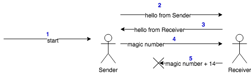
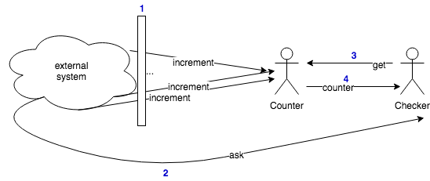
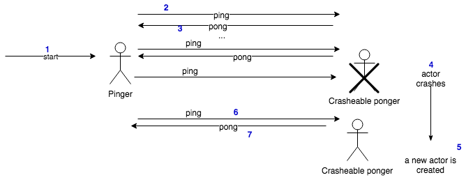

# Examples

This module contains examples of how to us the `actor-model-system` toolkit.

Most of them are trivial examples except for the one under the `mapreduce` folder. However, my recommendation is to look at the others first.

## Sender - Receiver

This examples demonstrates how two actors can communicate each other by just **sending messages** between them.
It also demonstrates that a message is not delivered to an actor that has no handler for it.




## Counter

This examples simulates an external system hitting a counter hold by an Actor named "Counter". 
Its aim is to demonstrate that actors are **thread-safe by default** and the probe is that after several hits, the total value of the counter is the expected one.




## Ping-Pong

This example represents two actors interchanging `ping-pong` messages. 
Moreover, it represents how the system is able to **recover itself from failure** and continue working when with certain probability one of the two actors crashes.



## Map reduce

This is the most interesting example and the only one solving a proper use case.
In this example I use the **map-reduce technique** to compute some KPIs (impressions, clicks and buys) from a given files representing events occurred at some point in the past.

The main idea consists of digesting files which look like:

```csv
impression,11
impression,45
impression,11
impression,3
click,11
impression,79
impression,11
impression,3
buy,11
click,3
click,3
impression,11
...
```

where the first is the name of the event and the second an id (note that events can appear in any order).

The expected output should be something like:
```csv
id,impression,click,buy
11,4,1,1
45,1,0,0
3,2,2,0
79,1,0,0
...
```

where, for each id, we have the total accumulated number of impressions, clicks and buy events.

### How to run it?

1. Generate fake event files 

    Go to the `misc` folder in the project's root and run:
   
    ```bash
    $ cd misc/
    $ python3 events_generator.py
    ```
    
    This will generate 3 files with randomized events under `examples/src/main/resources/` and a file named `expected_result.csv` in the same `misc` folder.
    
2. Run `MapReduceExample.java`

3. Compare the results produced by the `MapReduceExample.java` in a file named `statistics.csv` in the project's root folder, with 
the previous `expected_results.csv` file.

    ```bash
    $ diff misc/expected_result.csv statistics.csv
    ```

If everything went fine, both files should be identical :)

